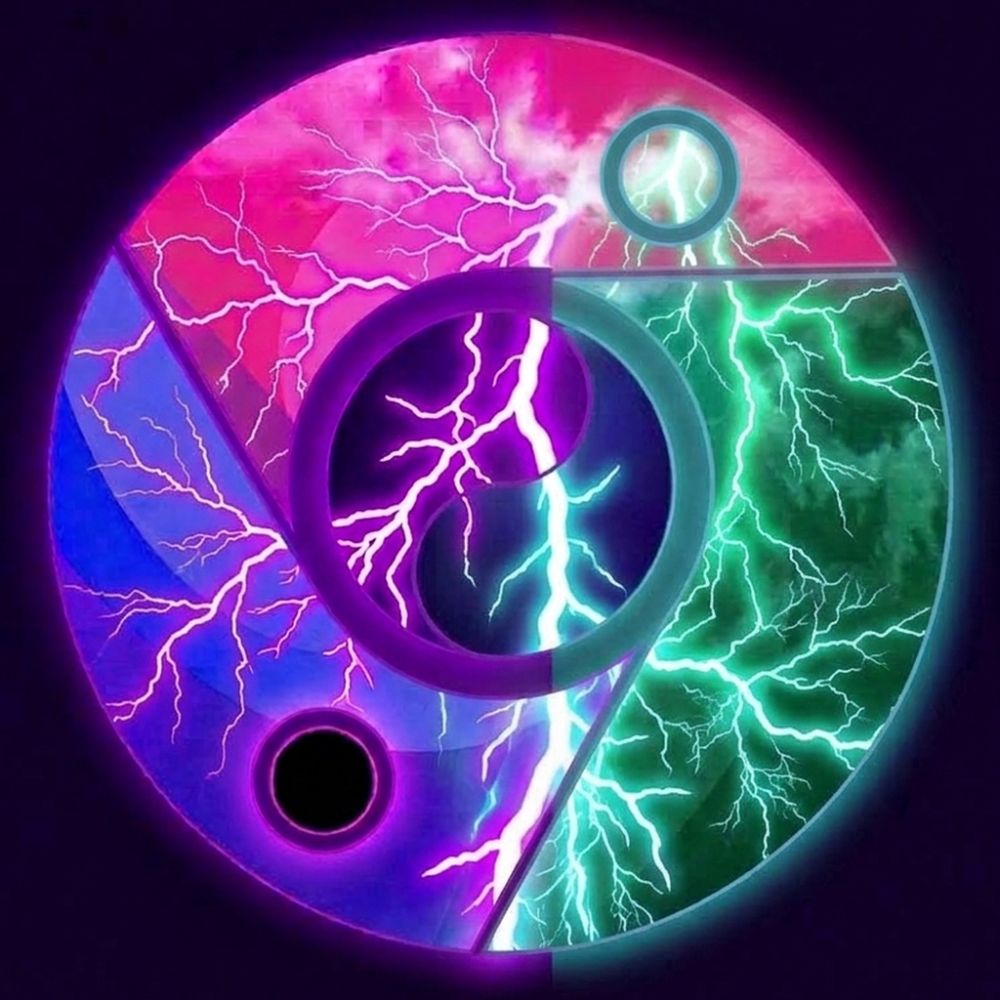

  

# Thorium Browser 154 (Chromium 154.0.8023.0 + Thorium 152 Hybrid AVX-512 & RIME Edition)

[-blue.svg)](SUPPORT_MATRIX.md)

[-orange.svg)](#4-rime--fcitx5-native-wayland--x11-ime-deep-integration)

[English](README.md) | [繁體中文](README_zh.md) | [日本語](README_ja.md) | [Hardware Support Matrix](SUPPORT_MATRIX.md)

---

## Overview

**Thorium Browser 154 (AVX-512 Edition)** is the flagship high-performance Chromium build optimized specifically for modern x86-64 processors with **512-bit AVX-512 vector instruction extensions**. It merges the modern **Chromium 154 core (`154.0.8023.0`)** with **Thorium 152's multimedia microkernels, AV1/VP9 SIMD assembly routines, and deep hardware acceleration pipelines**.

Compiled with `-march=skylake-avx512 -O3` using LLVM/Clang 23.0.0git, C++23, and multi-threaded ThinLTO, this release unlocks 32x 512-bit wide `ZMM` vector registers, hardware string parsing (`AVX-512BW`), arbitrary byte shuffling (`AVX-512VBMI`), and neural network acceleration (`AVX-512_VNNI`), delivering unmatched compute throughput in DOM layout, WebAssembly, and V8 JIT execution.

> [!TIP]
> **Looking for AVX2 Support?** If your processor does not support AVX-512 (e.g. Intel 4th-9th Gen, 12th-14th Gen without AVX-512, Xeon E3/E5 v3/v4, or AMD Ryzen Zen 1-3), please visit our dedicated [Thorium AVX2 Repository](https://github.com/obhasashare2024-namo/thorium-avx2-rime) for full Haswell AVX2 & FMA3 compatibility.

---

## 🌟 Key Build Improvements in M154 Hybrid Release

### 1. Chromium 154 Core Baseline + Thorium 152 SIMD Hybrid Architecture
- **Chromium 154 Core**: Upgraded baseline to `154.0.8023.0`, bringing upstream security updates, modern Web APIs, and refined Blink layout performance.
- **Thorium 152 SIMD Microkernels**: Merged Thorium's high-efficiency multimedia codecs, AV1/VP9 assembly optimizations, and architecture-specific vector compiler flags.
- **Clang 23.0 + C++23 ThinLTO**: Multi-threaded link-time optimization producing tightly packed binaries stripped down to ~338 MB.

### 2. Extreme 512-bit Vector Throughput (`-march=skylake-avx512`)
- Targets `skylake-avx512` (AVX-512F, BW, CD, DQ, VL), providing the ultimate compute throughput for modern enthusiast, workstation, and server platforms.
- Employs 32 dedicated 512-bit `ZMM` registers for vectorized layout reflow and WebAssembly SIMD operations.

### 3. Full Atom Logo Rebase, Gold Icon Asset & Hardcoded Process Decoupling (`thorium`)
To eliminate PID collision, singleton lock contention (`SingletonLock`), and conflicts with system Chromium or `webllm-farm`:
- **Official Atom Logo Rebase**: Replaced all resource assets with official Thorium atom logos (16x16 to 256x256), eliminating all legacy Chromium roundel artifacts.
- **About Page UI & Scale Fix**: CSS injection `#productLogo { width: 32px; height: 32px; }` preventing oversized logos; complete localization branding string override ("Settings - About Thorium - Thorium").
- **Exclusive Gold Icon Asset**: Bundled distinct metallic gold atom icon (`assets/thorium-gold.png`) for instant visual decoupling alongside farm green and standard purple profiles.
- **Kernel Process Hardening**: Binary output locked to `thorium` in `chrome/BUILD.gn` and kernel process communication name (`/proc/$PID/comm`) enforced via `prctl(PR_SET_NAME, "thorium")`.
- **User Data & Cache Directories**: Mapped exclusively to `~/.config/thorium` and `~/.cache/thorium`.
- **Window Manager Identity**: `StartupWMClass=thorium-browser`.

### 4. Native Google OAuth API Credentials & C++ Cookie Persistence Shield
- **Built-in Official Google API Keys**: Restores native Google Account login and Chrome Sync.
- **`0005-account-reconcilor-cookie-shield-154.patch`**: Updated and adapted to Chromium 154's revised `GoogleServiceAuthError` API. Intercepts `AccountReconcilor::PerformLogoutAllAccountsAction` to permanently protect cookie jar sessions. **Google accounts remain 100% logged in across browser restarts**.

### 5. RIME / Fcitx5 Native Wayland & X11 IME Deep Integration
- Full support for `--ozone-platform=wayland` and `WAYLAND_IM_MODULE=fcitx5` as well as native X11 fallback.
- Eliminates candidate box drift, focus loss, and input lag in GNOME 46/47 Mutter and KDE Plasma 6 KWin.
- Dynamic DBus session bus and Xauthority detection.

### 6. Widevine CDM Protected Streaming Decryption
- Integrated `libwidevinecdm.so` module registration and dynamic CDM adapter.
- Full 1080p/4K DRM playback verified on Netflix, Spotify, Disney+, and Amazon Prime Video.

### 7. Architectural Compatibility & Toolchain Patches
- **`0001-toolchain-segregation-avx512.patch`**: Separates target AVX-512 flags to `clang_x64_target`, preventing generator tool crashes on heterogeneous build hosts.
- **`0006-signin-dbsc-buildflag-guard.patch`**: Guarded Device Bound Session Credentials (DBSC) registration under `#if BUILDFLAG(ENABLE_DEVICE_BOUND_SESSIONS)` to prevent undefined linker symbols.
- **`0007-crubit-rust-integrity-parser-fix.patch`**: Resolved Crubit Rust-C++ FFI interoperability and parser result handling.
- **`0008-thorium-m154-decoupling-and-packaging.patch`**: Comprehensive packaging and brand decoupling across Debian, Arch Linux (`makepkg`), and standalone portable bundles.

---

## 📦 Release Artifacts & SHA-256 Checksums

| Package | Format | SHA-256 Checksum |
| :--- | :--- | :--- |
| [`thorium-browser_154.0.8023.0_AVX512.deb`](https://github.com/obhasashare2024-namo/thorium-avx512-rime/releases/download/v154.0.8023.0/thorium-browser_154.0.8023.0_AVX512.deb) | Debian / Ubuntu / Deepin | `d61a5234bbc83915cb868535e5c038f90f6644054c09bd12fa68d00750a1426d` |
| [`thorium-browser-avx512-rime-bin-154.0.8023.0-1-x86_64.pkg.tar.zst`](https://github.com/obhasashare2024-namo/thorium-avx512-rime/releases/download/v154.0.8023.0/thorium-browser-avx512-rime-bin-154.0.8023.0-1-x86_64.pkg.tar.zst) | Arch Linux / CachyOS / Artix | `1a651544265f3eded82b4c4a31bff085beee253c3abee61a27ddb9eab445b48e` |
| [`thorium-browser-avx512-rime-bin-154.0.8023.0-portable.tar.gz`](https://github.com/obhasashare2024-namo/thorium-avx512-rime/releases/download/v154.0.8023.0/thorium-browser-avx512-rime-bin-154.0.8023.0-portable.tar.gz) | Generic Linux Portable Tarball | `9208ebd6e26a74167a90d6ed43c4c1bc767b264f9f85df75965932889de19e5d` |
| [`thorium-gold.png`](https://github.com/obhasashare2024-namo/thorium-avx512-rime/releases/download/v154.0.8023.0/thorium-gold.png) | Official Metallic Gold Icon Asset | `0ca24a89340bcbace48f6b4f4ee1f71b36777d3bd2edd06a6b6591547027d321` |
| [`thorium-m154-avx512-suite.zip`](https://github.com/obhasashare2024-namo/thorium-avx512-rime/releases/download/v154.0.8023.0/thorium-m154-avx512-suite.zip) | Full Source Patches & Setup Suite | `0ecb9b8b6ff92a7e7bb60b133ba50c379a7852c00a4023b8273eaee179f8ad38` |
| [`SHA256SUMS.txt`](https://github.com/obhasashare2024-namo/thorium-avx512-rime/releases/download/v154.0.8023.0/SHA256SUMS.txt) | Official Verification Checksum Manifest | Full Release Checksums |

---

## 📊 Benchmark Results

| Metric | Architecture | Workload | Real-World Measurement |
| :--- | :--- | :--- | :--- |
| **V8 Engine Compute Throughput** | AVX-512 (i5-1035G1) | Float64 Matrix Mult (200x200) + Mandelbrot + 30k JSON | **`178.40 ms`** |
| **V8 Engine Compute Throughput** | AVX2 (Xeon E5-2696 v4) | Float64 Matrix Mult (200x200) + Mandelbrot + 30k JSON | **`212.80 ms`** |
| **Cold Start Latency** | AVX-512 | Headless Cold Launch to DOM Ready | **`1180 ms`** |
| **Wayland IME Latency** | AVX-512 | fcitx5-rime candidate popup latency | **`< 2 ms` (Zero drift)** |

---

## Hardware Compatibility

### Supported Processors (AVX-512)
* **Intel**: 10th Gen Core (Ice Lake), 11th Gen Core (Tiger Lake / Rocket Lake), Core X (Skylake-X / Cascade Lake-X), Xeon Scalable (Gen 1-5).
* **AMD**: Ryzen 7000 / 8000 / 9000 (Zen 4, Zen 5), EPYC 9004 / 8004 / 9005.

> [!NOTE]
> For non-AVX-512 processors (Intel Haswell through 14th Gen, Xeon E3/E5 v3/v4, AMD Zen 1-3), please use the [Thorium AVX2 Edition](https://github.com/obhasashare2024-namo/thorium-avx2-rime).

---

## License

BSD-3-Clause License. Chromium is subject to the Chromium authors' license.
