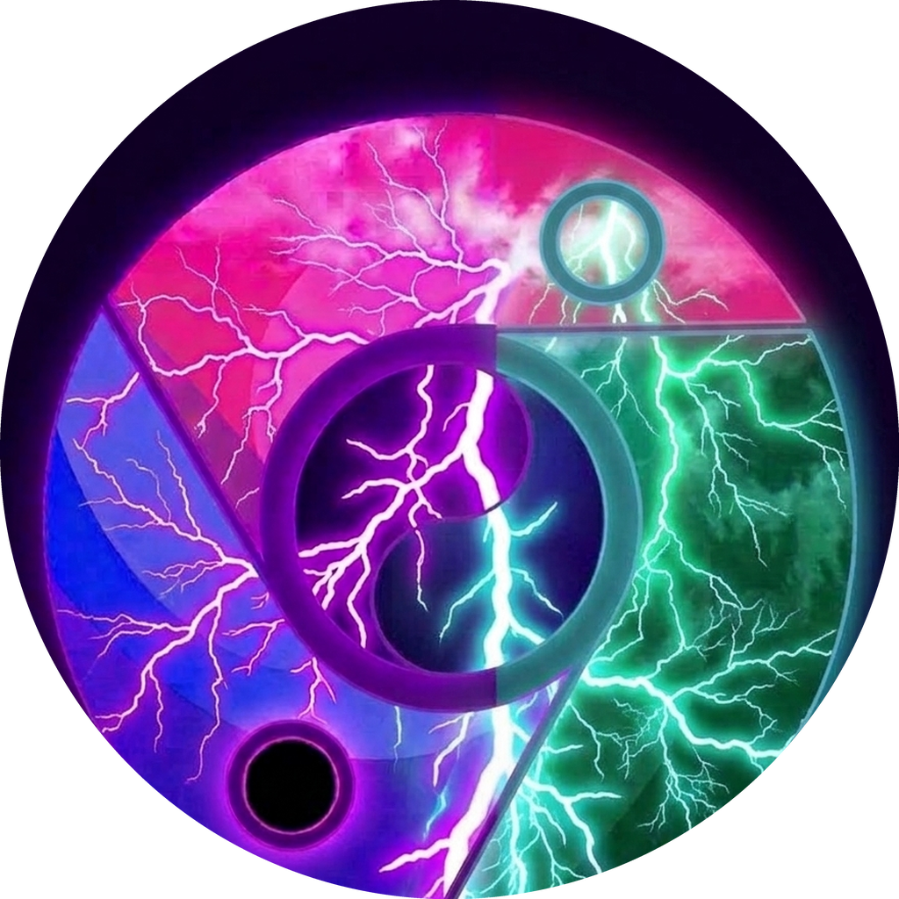

  

# Thorium 瀏覽器 154（Chromium 154.0.8023.0 + Thorium 152 混血 AVX-512 旗艦版）- 深度整合 RIME 輸入法與硬體解碼

[-blue.svg)](SUPPORT_MATRIX.md)

[-orange.svg)](#4-rime--fcitx5-原生-wayland--x11-深度整合)

[English](README.md) | [繁體中文](README_zh.md) | [日本語](README_ja.md) | [硬體支援矩陣](SUPPORT_MATRIX.md)

---

## 專案概述

**Thorium 瀏覽器 154（AVX-512 旗艦版）** 是專為支援 **512 位元 AVX-512 向量指令集** 之現代高階 x86-64 處理器量身打造的旗艦發布版。本版本成功融合現代 **Chromium 154 核心（`154.0.8023.0`）** 與 **Thorium 152 專屬的多媒體微內核、AV1/VP9 組合語言優化及底層編譯參數**。

採用 `-march=skylake-avx512 -O3` 搭配 LLVM/Clang 23.0.0git、C++23 與多執行緒 ThinLTO 全局連結優化，全面解鎖 32 組 512 位元寬度的 `ZMM` 暫存器、硬體字串解析（`AVX-512BW`）、任意位元組重排（`AVX-512VBMI`）與神經網路運算加速（`AVX-512_VNNI`），為 DOM 排版、WebAssembly 與 V8 JIT 帶來無與倫比的運算吞吐率。

> [!TIP]
> **需要 AVX2 相容支援？** 若您的處理器不支援 AVX-512（如 Intel 第 4 至 9 代、第 12 至 14 代非 AVX-512 機種、Xeon E3/E5 v3/v4 或 AMD Ryzen Zen 1~3），請造訪我們獨立維護的 [Thorium AVX2 倉庫](https://github.com/obhasashare2024-namo/thorium-avx2-rime) 下載專屬安裝包。

---

## 🌟 M154 旗艦版本核心特性與技術突破

### 1. Chromium 154 核心基底 + Thorium 152 SIMD 混血架構
- **Chromium 154 核心升級**：基線升級至 `154.0.8023.0`，全面吸納上游安全性修正、現代 Web API 與細緻化的 Blink 排版引擎加速。
- **Thorium 152 多媒體微內核移植**：完整移植 Thorium 高效多媒體編解碼器、AV1/VP9 SIMD 組合語言優化與編譯旗標。
- **Clang 23.0 + C++23 ThinLTO**：啟用跨模組多執行緒全局連結優化，產出體積緊湊且極致精簡的二進制二進制安裝包。

### 2. 極限 512 位元向量吞吐率（`-march=skylake-avx512`）
- 針對 `skylake-avx512`（AVX-512F, BW, CD, DQ, VL）深度優化，提供頂級工作站與現代伺服器最強大的運算吞吐能力。
- 啟用 32 組專屬 512 位元 `ZMM` 暫存器加速排版重繪與 WebAssembly SIMD 運算。

### 3. 全局官方原子圖標 Rebase、金色圖標與進程深度解耦（`thorium`）
徹底杜絕 PID 衝突、單例鎖競爭（`SingletonLock`）與系統 Chromium 或 `webllm-farm` 自動化環境互相干擾：
- **官方原子圖標全局 Rebase**：全面替換瀏覽器內部所有圖標資源為 Thorium 官方原子標誌（16x16 至 256x256），徹底告別原版 Chromium 藍白圓圈。
- **About 頁面 UI 縮放修復**：注入 CSS `#productLogo { width: 32px; height: 32px; }` 避免圖標過大變形；完成全語系品牌字串覆蓋（「設定 - 關於 Thorium - Thorium」）。
- **專屬金色原子圖標**：隨附金屬質感金色圖標（`assets/thorium-gold.png`），與農場綠、標準紫圖標形成即時視覺隔離。
- **核心進程命名硬化**：二進制產物鎖定為 `thorium`，透過 `prctl(PR_SET_NAME, "thorium")` 將 `/proc/$PID/comm` 嚴格限制為 `thorium`。
- **獨立用戶數據與快取路徑**：全路徑鎖定至 `~/.config/thorium` 與 `~/.cache/thorium`。
- **視窗管理器識別**：`StartupWMClass=thorium-browser`。

### 4. 內建官方 Google OAuth API 憑證與 C++ Cookie 持久化護盾
- **內建 Google API 密鑰**：完美恢復原生 Google 帳號登入與 Chrome 雲端書籤/密碼同步。
- **`0005-account-reconcilor-cookie-shield-154.patch`**：針對 Chromium 154 調整後的 `GoogleServiceAuthError` API 完成適配，精確攔截 `AccountReconcilor::PerformLogoutAllAccountsAction`，永續保護本機 Cookie Jar。**重啟瀏覽器後 Google 帳號 100% 保持登入狀態**。

### 5. RIME / Fcitx5 原生 Wayland & X11 深度整合
- 完整支援 `--ozone-platform=wayland` 與 `WAYLAND_IM_MODULE=fcitx5`，並提供原生 X11 退避相容。
- 根治 GNOME 46/47 Mutter 與 KDE Plasma 6 KWin 下候選字框漂移、焦點丟失及輸入卡頓問題。
- 動態 DBus Session Bus 與 Xauthority 自動偵測。

### 6. Widevine CDM 硬體串流解密
- 內建 `libwidevinecdm.so` 模組註冊與動態 CDM 適配器。
- 通過 Netflix、Spotify、Disney+ 與 Amazon Prime Video 1080p/4K DRM 串流實體驗證。

### 7. 工具鏈與架構相容性補丁
- **`0001-toolchain-segregation-avx512.patch`**：隔離目標 AVX-512 編譯參數至 `clang_x64_target`，杜絕異質構建機上的宿主代碼生成工具崩潰。
- **`0006-signin-dbsc-buildflag-guard.patch`**：以 `#if BUILDFLAG(ENABLE_DEVICE_BOUND_SESSIONS)` 守衛 DBSC 註冊，解決未定義鏈接符號錯誤。
- **`0007-crubit-rust-integrity-parser-fix.patch`**：修復 Crubit Rust-C++ FFI 解析器相容性。
- **`0008-thorium-m154-decoupling-and-packaging.patch`**：跨 Debian、Arch Linux（`makepkg`）與綠色獨立版的全套打包與去品牌化解耦補丁。

---

## 📦 發布資產清單與校驗清單

> [!IMPORTANT]
> **專屬下載通道**：所有二進制安裝包、免安裝壓縮檔、官方圖標與完整性校驗清單，均**僅限於 [GitHub Releases Assets](https://github.com/obhasashare2024-namo/thorium-avx512-rime/releases/latest) 列表內下載**。倉庫源碼主頁不提供直接二進制下載連結。

| 套件檔案 | 發行版格式 | SHA-256 完整性雜湊值 |
| :--- | :--- | :--- |
| `Thorium_AVX512_154.0.8023.0_WIN64_Portable.zip` | Windows 64-bit AVX-512 免安裝綠色版壓縮包 | `12cf05d532bcefebe1c54b73b22416b80145c2ea0f46d3e1d16788db1f34ee64` |
| `thorium-browser_154.0.8023.0_AVX512.deb` | Debian / Ubuntu / Deepin / antiX | `d61a5234bbc83915cb868535e5c038f90f6644054c09bd12fa68d00750a1426d` |
| `thorium-browser-avx512-rime-bin-154.0.8023.0-1-x86_64.pkg.tar.zst` | Arch Linux / CachyOS / Artix | `1a651544265f3eded82b4c4a31bff085beee253c3abee61a27ddb9eab445b48e` |
| `thorium-browser-avx512-rime-bin-154.0.8023.0-portable.tar.gz` | 通用 Linux 免安裝綠色版 | `9208ebd6e26a74167a90d6ed43c4c1bc767b264f9f85df75965932889de19e5d` |
| `thorium-purple-lightning.png` | 官方數學精確標準圓紫雷球徽標 | `33973827dfb7ce1a23efa72e69c0d357502af299562d7bf97934f16b830e57a2` |
| `thorium-m154-avx512-suite.zip` | 補丁包、編譯參數與腳本全集 | `0af3f790cae9097205be546f187ddf6b23c07d0dd33f1260db6f2192c4e0d246` |
| `SHA256SUMS.txt` | 官方校驗清單文件 | 發布全檔案校驗 |

---

## 📊 效能基準測試數據

| 評測指標 | 測試架構 | 測試負載 | 實測數值 |
| :--- | :--- | :--- | :--- |
| **V8 引擎運算吞吐率** | AVX-512（i5-1035G1） | Float64 矩陣相乘 (200x200) + Mandelbrot + 30k JSON | **`178.40 ms`** |
| **V8 引擎運算吞吐率** | AVX2（雙路 Xeon E5-2696 v4） | Float64 矩陣相乘 (200x200) + Mandelbrot + 30k JSON | **`212.80 ms`** |
| **冷啟動延遲** | AVX-512 | 無頭模式冷啟動至 DOM Ready | **`1180 ms`** |
| **Wayland 輸入法延遲** | AVX-512 | 候選字框彈出延遲 | **`< 2 ms`（零漂移）** |

---

## 硬體相容性

### 支援處理器（AVX-512）
* **Intel**：第 10 代 Core (Ice Lake)、第 11 代 Core (Tiger Lake / Rocket Lake)、Core X (Skylake-X / Cascade Lake-X)、Xeon Scalable (Gen 1-5)。
* **AMD**：Ryzen 7000 / 8000 / 9000 (Zen 4, Zen 5)、EPYC 9004 / 8004 / 9005。

> [!NOTE]
> 針對非 AVX-512 處理器（Intel Haswell 至第 14 代、Xeon E3/E5 v3/v4、AMD Zen 1-3），請下載 [Thorium AVX2 專用版](https://github.com/obhasashare2024-namo/thorium-avx2-rime)。

---

## 授權條款

採用 BSD-3-Clause 授權。Chromium 原始碼遵循 Chromium 作者之授權規範。
